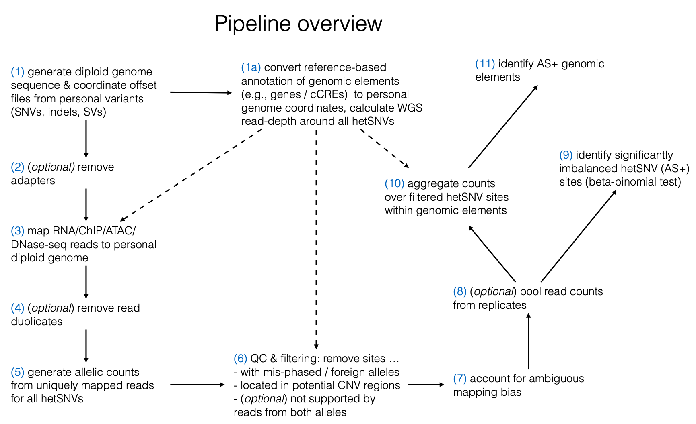

``SAMTOOLS``: Samtools  
# AlleleSeq2

## Generate personal genomes, STAR indices and other helper files:

### Makefile options (can be specified in makePersonalGenome.mk or as command-line arguments)
#### Dependencies, system parameters/paths:  
``VCF2DIPLOID_DIR``: vcf2diploid (http://alleleseq.gersteinlab.org/tools.html)  
``PL``: path to AlleleSeq2  
``LIFTOVER``: UCSC liftOver tool  
``BEDTOOLS_intersectBed``: Bedtools intersectBed   
``SAMTOOLS``: Samtools  
``STAR``: STAR aligner  

#### Other options:
``N_THREADS``: number or threads (for STAR genomeGenerate)  
``REFGENOME_VERSION``: reference genome version, 'GRCh37' or 'GRCh38'  
``REFGENOME``: path to the reference genome .fasta file  
``FILE_PATH_VCF``: path to VCF  
``VCF_SAMPLE_ID``: sample name in VCF  
``FILE_PATH_BAM``: path to WGS bam  
``OUTPUT_DIR``: output folder  

### Example: 
```
make -f makePersonalGenome.mk \
        N_THREADS=8 \
        VCF_SAMPLE_ID=sge_Aug_encodev2_2_local \
        REFGENOME_VERSION=GRCh38 \
        OUTPUT_DIR=pgenome_ENC-003 \
        FILE_PATH_BAM=ENCFF200XCY.bam \
        FILE_PATH_VCF=enc003.spliced.scrubbed.vcf 
```


## (1) Calling AS+ hetSNVs from a single sample
### Makefile options (can be specified in PIPELINE.mk or as command-line arguments):
#### Dependencies:
##### python2 
scipy  
numpy  
pandas  
##### R
VGAM  
ggplot2  
#### Dependencies, system parameters/paths:
``PL``: path to AlleleSeq2  
``SAMTOOLS``: samtools  
``PICARD``: Broad picard tools  
``STAR``: STAR aligner
``FASTQC``: FastQC quality control tool  
``CUTADAPT``: Cutadapt to remove adapter sequences (ATAC-seq samples)

#### Other options:  
``READS_R1``: path to input .fastq file (R1)  
``READS_R2``: path to input .fastq file (R2, if PE sequencing)  
``PGENOME_DIR``: path to personal genome folder  
``VCF_SAMPLE_ID``: sample name in VCF  
``ALIGNMENT_MODE``: 'ASE' for RNA-seq, 'ASB' for ChIP-seq' and 'ASCA' for ATAC-seq  
``RM_DUPLICATE_READS``: 'on' to remove duplicate reads with picard tools  
``STAR_readFilesCommand``: --readFilesIn option in STAR  
``REFGENOME_VERSION``: reference genome version, 'GRCh37' or 'GRCh38'  
``Annotation_diploid``: path to diploid GENCODE gene annotation (for 'ASE')  
``FDR_CUTOFF``: FDR threshold  
``Cntthresh_tot``: threshold for the total number of reads mapped to hetSNV  
``Cntthresh_min``: threshold for the minimal number of reads mapped to each allele  

 

### Example:
```
make -f PIPELINE.mk \
        PGENOME_DIR=pgenome_ENC-003 \
        REFGENOME_VERSION=GRCh38 \
        NTHR=8 \
        READS_R1=ENCFF337ZBN.fastq.gz \
        READS_R2=ENCFF481IQE.fastq.gz \
        STAR_readFilesCommand=zcat \
        ALIGNMENT_MODE=ASE \
        RM_DUPLICATE_READS=on \
        FDR_CUTOFF=0.10 \
	VCF_SAMPLE_ID=sge_Aug_encodev2_2_local
```

The main output containing ASE hetSNVs is   
ENCFF337ZBN_ENCFF481IQE_interestingHets.FDR-0.10.betabinom.chrs1-22.6-tot_0-min_cnt.tsv


## (2) Pool replicates / tissues

### Makefile options (can be specified in PIPELINE_aggregated_counts.mk or as command-line arguments)
#### Dependencies, system parameters/paths:  
``PL``: path to AlleleSeq2  
``PGENOME_DIR``: path to personal genome folder 
``VCF_SAMPLE_ID``: sample name in VCF  
``INPUT_UNIQ_READS_PILEUP_FILES``: list of .mpileup files with uniquely mapped reads to aggregate generated in (1) 
``INPUT_MMAP_READS_PILEUP_FILES``: list of .mpileup files with multi-mapping reads to aggregate generated in (1) 
``PREFIX``: prefix for output file names 
``Cntthresh_tot``: threshold for the total number of reads mapped to hetSNV  
``Cntthresh_min``: threshold for the minimal number of reads mapped to each allele  


```

make -f PIPELINE_aggregated_counts.mk \
        PGENOME_DIR=pgenome_ENC-003 \
        INPUT_UNIQ_READS_PILEUP_FILES="../ENCSR238ZZD_ENCFF719MSG_1_ENCFF120MML_2_1_1/ENCFF719MSG_ENCFF120MML_hap1_uniqreads.mpileup    ../ENCSR238ZZD_ENCFF719MSG_1_ENCFF120MML_2_1_1/ENCFF719MSG_ENCFF120MML_hap2_uniqreads.mpileup ../ENCSR238ZZD_ENCFF337ZBN_1_ENCFF481IQE_2_1_1/ENCFF337ZBN_ENCFF481IQE_hap1_uniqreads.mpileup ../ENCSR238ZZD_ENCFF337ZBN_1_ENCFF481IQE_2_1_1/ENCFF337ZBN_ENCFF481IQE_hap2_uniqreads.mpileup" \
        INPUT_MMAP_READS_PILEUP_FILES="../ENCSR238ZZD_ENCFF719MSG_1_ENCFF120MML_2_1_1/ENCFF719MSG_ENCFF120MML_hap1_mmapreads.mpileup ../ENCSR238ZZD_ENCFF719MSG_1_ENCFF120MML_2_1_1/ENCFF719MSG_ENCFF120MML_hap2_mmapreads.mpileup ../ENCSR238ZZD_ENCFF337ZBN_1_ENCFF481IQE_2_1_1/ENCFF337ZBN_ENCFF481IQE_hap1_mmapreads.mpileup ../ENCSR238ZZD_ENCFF337ZBN_1_ENCFF481IQE_2_1_1/ENCFF337ZBN_ENCFF481IQE_hap2_mmapreads.mpileup" \
        PREFIX=ENCSR238ZZD \
        FDR_CUTOFF=0.10 \
        VCF_SAMPLE_ID=sge_Aug_encodev2_2_local
```

The main output file: ENCSR238ZZD_interestingHets.FDR-0.10.binom.chrs1-22.6-tot_0-min_cnt.tsv


## (3) Aggregate across genomic elements, e.g. genes. ### 

```
make -f ~/bin/AlleleSeq2/PIPELINE_aggregate_over_genomic_regions.mk \
	  PREFIX=ENCSR238ZZD \
	  REGIONS_FILE="../../../../pgenomes_20191127/gencode.v24_all_genes.bed" \
	  COUNTS_FILE=../ENCSR238ZZD_combined/ENCSR238ZZD_filtered_counts.tsv \
	  UNIQ_ALN_FILES='../ENCSR238ZZD_ENCFF719MSG_1_ENCFF120MML_2_1_1/ENCFF719MSG_ENCFF120MML_ASE-params_crdsorted_uniqreads_over_hetSNVs.bam ../ENCSR238ZZD_ENCFF337ZBN_1_ENCFF481IQE_2_1_1/ENCFF337ZBN_ENCFF481IQE_ASE-params_crdsorted_uniqreads_over_hetSNVs.bam' \
	  MMAP_ALN_FILES='../ENCSR238ZZD_ENCFF719MSG_1_ENCFF120MML_2_1_1/ENCFF719MSG_ENCFF120MML_ASE-params_crdsorted_mmapreads_over_hetSNVs.bam ../ENCSR238ZZD_ENCFF337ZBN_1_ENCFF481IQE_2_1_1/ENCFF337ZBN_ENCFF481IQE_ASE-params_crdsorted_mmapreads_over_hetSNVs.bam' \
	  FDR_CUTOFF=0.10  
```


All input files should be produced from (1) or (2)   
REGIONS_FILE: must be a bed file: with gene(region) coordinates and id    
The main output file with ASE genes: ENCSR238ZZD_interesting_regions.FDR-0.10.betabinom.chrs1-22.6-tot_0-min_cnt.tsv   
